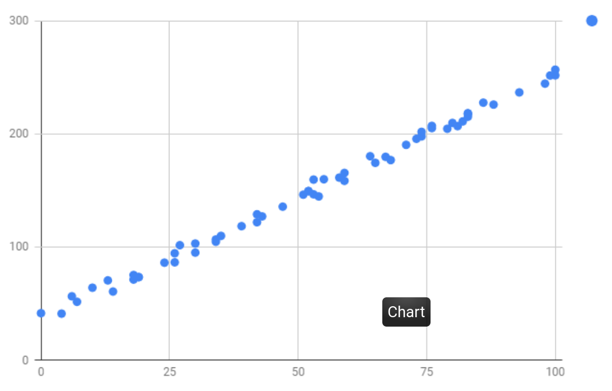

# HOMEWORK #1: Linear Regression and Trash<sup>1</sup>

The crew of Planet Express is currently engaged in the mining of a trash
asteroid from full of remnants from the 20th century. Chunks of the asteroid may
be trash in space but they are treasures for collectors in e-bay. The crew has
collected data for several chunks of the asteroid:  their mass and the price
they sell for. Help Planet Express make predictions about the selling price they
can expect from newly mined asteroid chunks. You will train a "Linear Learner"
to perform regression on the data collected by the crew of Planet Express.


## Input
The file `trashdata.txt` contains the training data for this regression problem.
The first column is the mass of an asteroid chunk. The second column is the
price the chunk sold for. The file `moretrashdata.txt` contains the validation
data for this regression problem. You can visualize the training data in the
following scatter plot:



## Gradient Descent
You will implement your Linear Learning using gradient descent, and will use the
Sum-of- Squares as the error measurement for your learner. Your objective is
then to minimize the function:

`SSE(E) = ∑e in E ( Y(e) - Y^(e) )2`

where `E` is the set of examples, `Y(e)` is the data value for an example `e`,
and `Y^(e)` is the output of the learner given by:

`Y^(e) = ∑i=0n ( wi * Xi(e) )`

Notice that we are not applying a squash function. This is because we are doing
regression, and not classification.  You shall implement incremental gradient
descent. This means that you will be updating the learner's weights after each
example. Your program should perform 5000 iterations of gradient descent.
Initialize the weights randomly in the range [0..100]. The learning rate 𝜂 (eta)
is left for you to decide. Experiment with different values and search for one
that yields good results.

## Validation
After performing gradient descent on the training data, your program should
evaluate the performance of your learner against the validation data by
computing the sum-of-squares error between the validation data and your
learner's predictions. Do not use the validation data to train!.

## Output
Your program should produce text output and report the learning rate used, the
final weights after gradient descent, and the performance of your learner in the
format exemplified in the sample below:

### Sample Output
```
CS-5001: HW#1 
Programmer: Dr. Hubert J. Farnsworth

TRAINING
Using random seed = 123456
Using learning rate eta = 0.001
After 5000 iterations:
Weights:
w0 = 3.1415
w1 = 42.0

VALIDATION
Sum-of-Squares Error = 1237491.2831
```

## Submission Guidelines
You will submit through the department's Unix machines using the command:

`cssubmit 5001 a 1`

Your submission will consists of the following components:

Your program files.- Submit all necessary files. Your main program file should
be called 'learner1.X' where X is the extension of whatever programming language
you are using. Your program should produce output formatted like in the sample.
A text file, called 'learner1output.txt', in which you capture the output of
your program for the run that achieved the best results.

Pseudocode:
```
PROCEDURE Incremental_Linear_Learner
GIVEN:
E[0..n] : examples, each a <x, y> pair
eta : the learning rate
LOCAL:
    w[0,1] : weights
Randomize w[0], w[1].
REPEAT 5000 times
    FOR k := 0 to n DO                        // go through examples
        Compute yCap ( from w[0], w[1] and E[k] ) 
        delta :=  Ex[k].y - yCap
        FOR each weight w[i]
w[i] := w[i]  +  eta * delta * E[k].x[i] 
         return w[]
END.
```

<sup>1</sup>: Due Monday, October 8th, 11:59:59pm